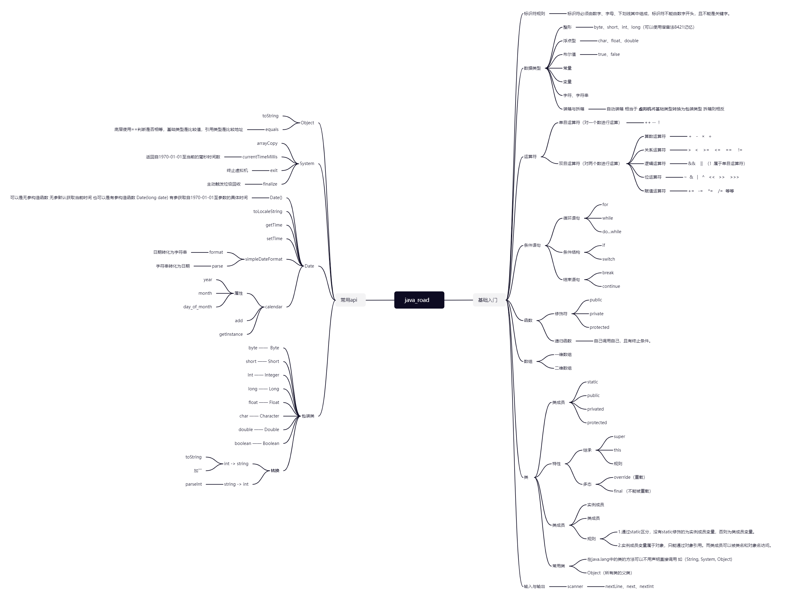

# java_road
零基础入门java学习路线

|  学习日期  |               学习内容               |
| :--------: | :----------------------------------: |
| 2023-07-17 | 了解Java的编译过程以及输出helloWorld |
| 2023-07-18 | java的基础入门 |
| 2023-07-22 |java的基础入门|
| 2023-07-23 |条件语句、函数、数组的基本使用|

