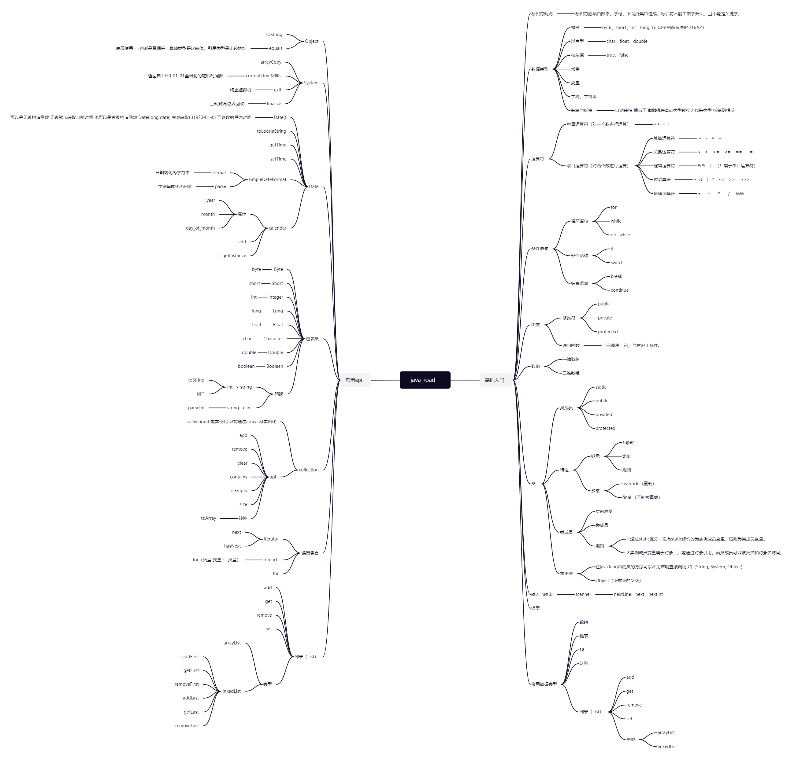

# java_road
最好的输入就是输出。争取以最简单的话语，最清晰的图片，构建java知识体系😁。

|  学习日期  |               学习内容               |
| :--------: | :----------------------------------: |
| 2023-07-17 | 了解Java的编译过程以及输出helloWorld |
| 2023-07-18 | java的基础入门 |
| 2023-07-22 |java的基础入门|
| 2023-07-23 |条件语句、函数、数组的基本使用|
| 2023-07-25 |类的原理理解以及基本使用|
| 2023-07-27 |学习java常用api|
| 2023-07-28 |了解泛型、集合等数据类型以及常用api|
|  ||

